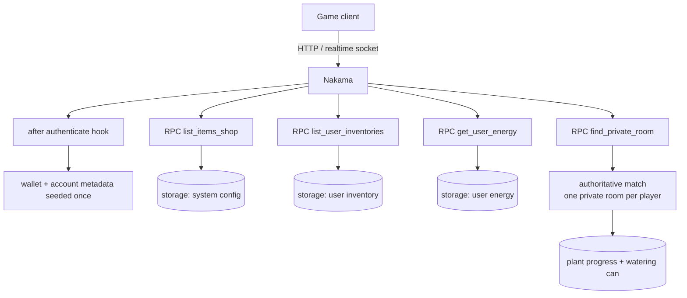

# ts-nakama-game-demo

A **Nakama game backend plugin written in TypeScript**: device login with an
after-authenticate hook that initialises the player's wallet, a server-authoritative
per-player match, storage-backed inventory / shop / energy, and four RPC entry points.

Everything runs from a clean clone with one command:

```
$ make up
  [PASS] server is healthy - http://127.0.0.1:7350
  [PASS] authenticate by device - user_id=df68d3e4-6e30-4f12-8949-eafe58edc23d
  [PASS] rpc get_user_energy - 50/50
  [PASS] rpc list_user_inventories - 0 entries
  [PASS] rpc list_items_shop - 0 entries (0 until shop config is seeded)
  [PASS] rpc find_private_room - match_id=1bd2102e-f1be-4728-b70b-51767bce3274.nakama-node-1
  [PASS] private room is reused for the same player - indexed after ~750ms
OK - plugin loaded, hook ran, RPCs and the match handler are reachable
```

## What this demonstrates

- **Nakama plugin architecture**: `InitModule` registers RPCs, an after-authenticate hook and
  an authoritative match handler, with the game logic split into
  `controllers` (use cases) / `repositories` (storage access) / `mappers` (wire DTOs) /
  `models` (persisted shapes) / `configs` (collection and key names).
- **Hooks over duplicated logic**: every first login goes through
  `registerAfterAuthenticateDevice`, which seeds the wallet and account metadata exactly once
  (guarded by a `hasInit` flag) instead of every RPC having to know how a new player looks.
- **Storage as the game database**: player inventory, energy, watering-can and plant progress
  live in Nakama storage collections; server-side config (items, shop, seeds, timers) lives in
  the `system` collection under a reserved user id, so it can be edited without a redeploy.
- **Server-authoritative session**: `find_private_room` gives a player their own match
  (`limitRoom = 1`, `tickRate = 5`), and the match loop is where time-based gameplay belongs -
  the client never decides how much water a plant has left.
- **Energy regeneration on read**: `get_user_energy` settles the elapsed intervals, caps at
  `MAX_USER_ENERGY` and persists the new `nextTimeToReset`, the usual "lazy" way to model
  regenerating resources without a scheduler.
- **A real end-to-end test**: `scripts/smoke.mjs` drives the public HTTP API
  (authenticate → four RPCs → match reuse) so CI proves the container, the migration, the
  compiled plugin and the hook all work - not just that TypeScript compiles.

## Architecture



## RPCs

| RPC | auth | returns |
|---|---|---|
| `get_user_energy` | yes | `{currentEnergy, maxEnergy, nextTimeToReset, currentTime}` after settling elapsed intervals |
| `list_user_inventories` | yes | the player's inventory entries |
| `list_items_shop` | yes | the shop list built from the server-side item + shop config (empty until that config is seeded in storage) |
| `find_private_room` | yes | `{matchId}` - the player's existing room, created on first call |

The plugin also registers the `dy` match handler (`matchInit`, `matchJoinAttempt`, `matchJoin`,
`matchLeave`, `matchLoop`, `matchTerminate`, `matchSignal`).

## Quickstart

Requires Docker with the compose plugin.

```bash
git clone https://github.com/lasttoss/ts-nakama-game-demo.git
cd ts-nakama-game-demo
make up        # builds the plugin image, starts postgres + nakama, runs the smoke test
make console   # prints the console URL (user "admin", password from local.yml)
make down
```

Ports `7350` / `7351` already taken? Copy `.env.example` to `.env` and change
`NAKAMA_PORT` / `CONSOLE_PORT`; `make up` and `make smoke` both read that file.

Working on the plugin itself:

```bash
npm install
npx tsc --noEmit     # type check
npx tsc              # emit build/index.js (the file Nakama loads)
```

Nakama loads `build/index.js` from the image, so after changing the TypeScript you need
`docker compose up -d --build` to see it in the container.

## Configuration

`local.yml` is the Nakama config baked into the image (dev placeholders: server key
`defaultkey`, console password `password` - change both before exposing it anywhere).
`docker-compose.yml` reads `.env` (see `.env.example`) for the database URL, the Nakama
config filename and the host ports.

## Fixed while preparing this repository

The version first pushed here had been run only on a laptop, and three of the four problems
would have stopped anybody from reproducing it:

1. **`docker compose up` could not build.** The plugin image is `node:20-alpine` and
   `nakama-runtime` is a git dependency (`github:heroiclabs/nakama-common`), but alpine has no
   `git`, so `npm install` died with `spawn git ENOENT`. The image now installs it.
2. **The compose file was committed as `.bak`** together with a `.env.bak`, so the stack the
   README told you to start did not exist. The root cause was
   `.gitignore`, which excluded `docker-compose.yml` itself, so the file had been renamed to
   `.bak` to get it committed at all. Both are now real files - with postgres, which the previous
   compose file assumed was already running - plus a documented `.env.example`.
3. **`find_private_room` did not behave like its name.** It looked the room up with
   `matchList(1, true, "", 0, 1, "+userId:" + userId)`, but the match registry filters on the
   indexed match *label*, so the lookup never matched: every call created another authoritative
   match for the player. Worse, moving the filter to the `label` argument made the runtime
   return matches belonging to *other* players - a room leak. The lookup now lists the registry
   and requires an exact label match, so a player only ever gets their own room.
4. **Compiled output was committed and stale.** `build/index.js` in git did not match the
   TypeScript sources (a rebuild produced 1110 insertions). It is no longer tracked, and the
   image builds it from source.

## Notes / limitations

- `list_items_shop` returns an empty list on a fresh database: item and shop config are read
  from the `system` storage collection and this repository does not seed it (it is normally
  filled by a CMS).
- Energy uses fixed constants from `games/constants/constants.ts`; the same values are read
  from storage in the full game.
- Facebook login is not wired up.

## License

MIT - see [LICENSE](LICENSE). Nakama itself is Apache-2.0 (`heroiclabs/nakama`), and this
repository links against `nakama-runtime` (Apache-2.0) - neither is redistributed here.

## Tests

```bash
npm run build      # tsc: every file is a global script, concatenated into build/index.js
npm test           # TZ=UTC node --test test/*.test.mjs
```

The project is written the template way: TypeScript concatenates every file into one bundle
(`outFile`), so the functions are not importable. `test/unit.test.mjs` therefore runs the shipped
artefact - `build/index.js` - inside a fresh VM context and calls what the server would call, which
means the tests exercise the bundle that actually loads into Nakama rather than a second copy of
the sources. A fake `Date` freezes the clock for anything time shaped, and a fake `nk` answers the
storage read the config repositories need.

15 tests over the pure logic: the room picker (including the regression that a player is never
handed a room whose label merely starts like theirs), the clock helpers, the amount formatter, and
the storage-object-to-DTO mappers, including the shop mapper's "not on sale" filter and its
behaviour when the item config is empty. CI runs them on every push, before the end-to-end test that
loads the plugin into a real Nakama container.
